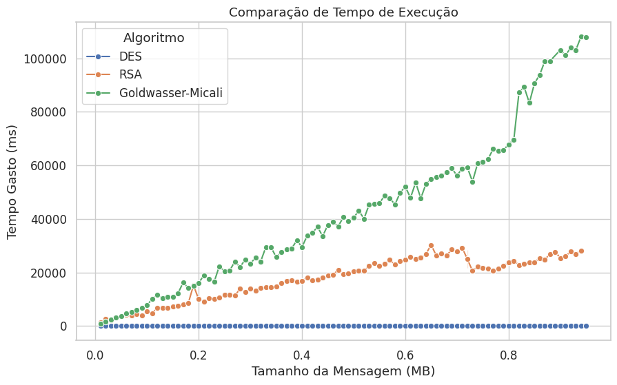

---

### 📈 Comparação de Tempo de Execução — DES, RSA e Goldwasser-Micali

O gráfico acima mostra a relação entre o **tamanho da mensagem (MB)** e o **tempo gasto (ms)** pelos algoritmos **DES**, **RSA** e **Goldwasser-Micali (GM)**.

---

### 🧠 Análise

- 🔹 **DES** apresenta um comportamento **linear e estável**, com tempo praticamente constante mesmo para mensagens maiores.  
  Isso ocorre porque o DES é um **algoritmo simétrico** baseado em **blocos fixos de 64 bits**, o que garante **eficiência e escalabilidade**.

- 🔸 **RSA** mostra um **crescimento gradual** no tempo de execução conforme aumenta o tamanho da mensagem.  
  Como um algoritmo **assimétrico**, ele utiliza **exponenciações modulares** que são **computacionalmente custosas**, justificando o aumento no tempo.

- 🟢 **Goldwasser-Micali (GM)** exibe o **maior tempo de execução** e um **crescimento acentuado**, chegando a ultrapassar **100.000 ms** (~100 segundos) para mensagens próximas de **1 MB**.  
  Isso ocorre porque o GM é um algoritmo **probabilístico bit a bit**, cifrando **cada bit individualmente**, o que resulta em **alto custo computacional**.

---

### 📊 Conclusões

- ✅ O **DES** é o mais **eficiente** e **escalável**, mantendo tempos muito baixos mesmo para mensagens grandes.  
- ⚖️ O **RSA** tem **desempenho intermediário**, mas o custo aumenta de forma proporcional ao tamanho da mensagem.  
- ❌ O **Goldwasser-Micali** é o **menos eficiente**, tornando-se **inviável** para grandes volumes de dados.

---

### ⚙️ Implicações Práticas

- **DES** é ideal para **grandes volumes de dados**, como em comunicações contínuas ou armazenamento seguro.  
- **RSA** e **GM** são mais adequados para **pequenas mensagens** ou **distribuição de chaves**, como em **sistemas híbridos** (ex: RSA para cifrar a chave, DES para cifrar os dados).

---

### 💡 Observações Finais

O estudo reforça a diferença entre **algoritmos simétricos** e **assimétricos**:
- Os **simétricos** têm **complexidade linear** e **alta eficiência**.
- Os **assimétricos** têm **complexidade mais alta** e são menos escaláveis.

Assim, o **uso combinado** (simétrico + assimétrico) é a prática mais eficiente em sistemas criptográficos modernos.

---
